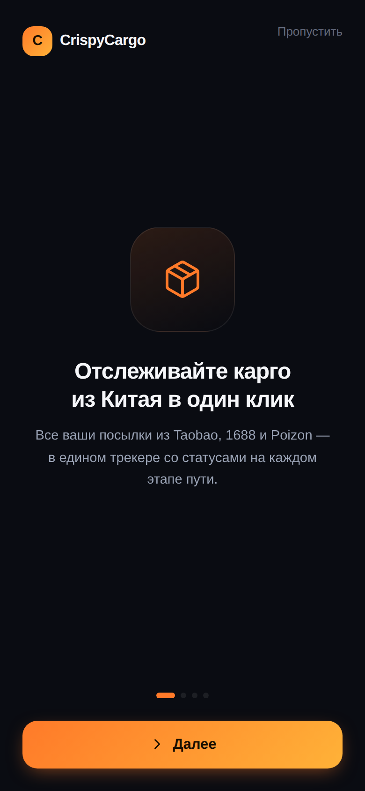
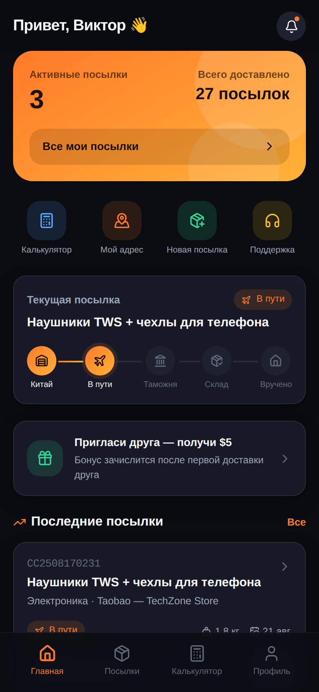
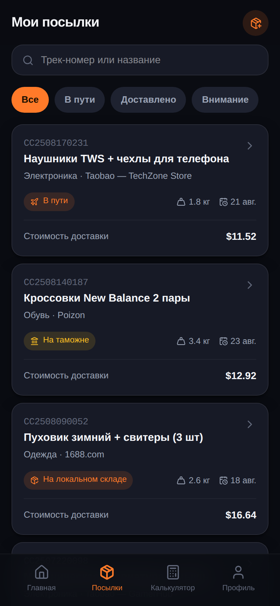
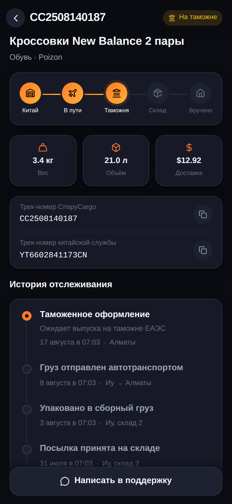
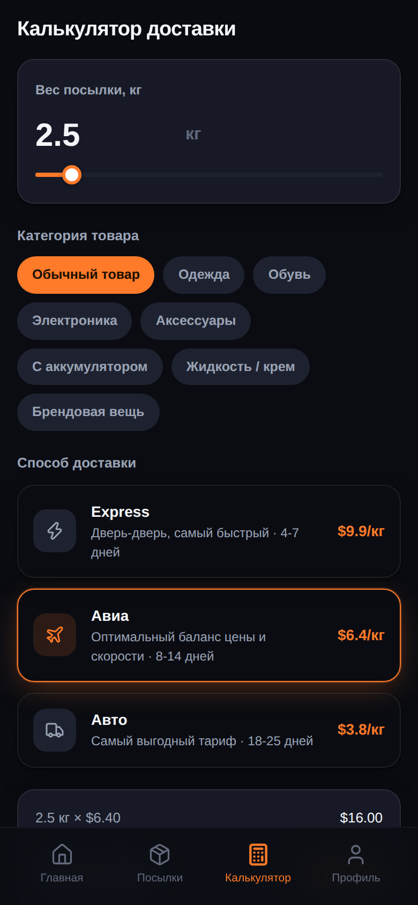
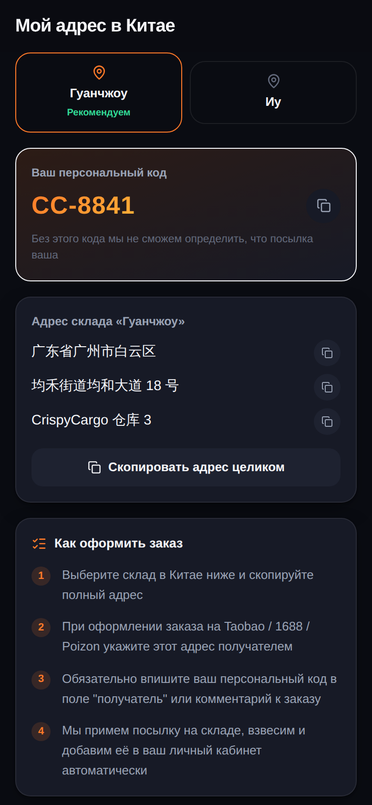
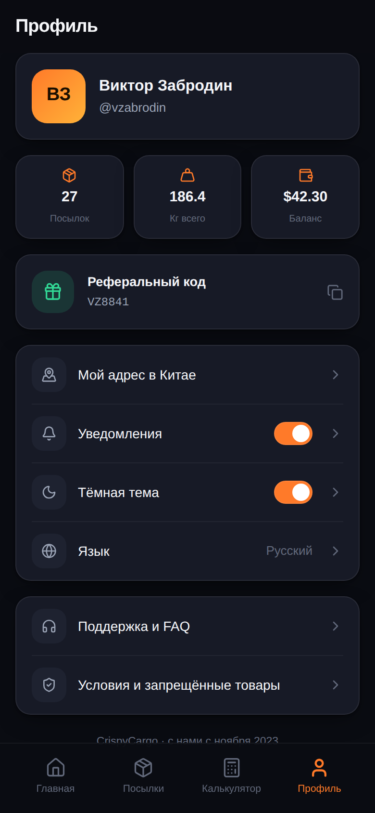
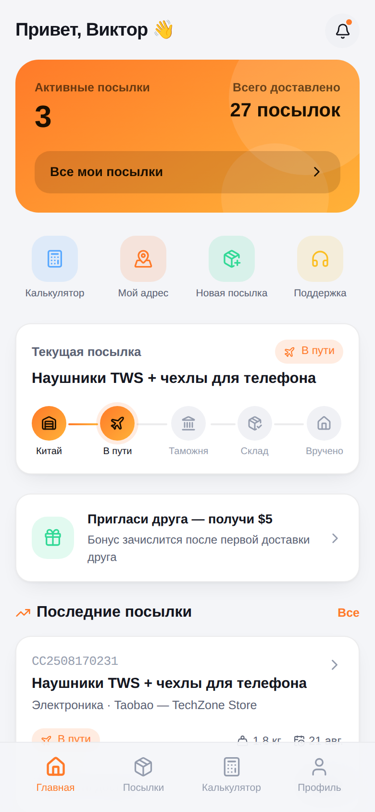

# CrispyCargo 🧧📦

Telegram Mini App для карго-компании, которая возит посылки из Китая (Taobao, 1688, Poizon и т.д.). Полноценный проект «из коробки»: мини-апп на React, бэкенд на Express + Prisma и Telegram-бот на grammY. Всё готово к тому, чтобы подключить реальные данные и начать работать.

## Скриншоты

| Онбординг | Главная | Мои посылки |
|---|---|---|
|  |  |  |

| Детали посылки | Калькулятор | Мой адрес в Китае |
|---|---|---|
|  |  |  |

| Профиль | Светлая тема |
|---|---|
|  |  |

## Возможности

**Для клиента (Mini App):**
- 📦 Отслеживание посылок с наглядным пошаговым статусом (Китай → в пути → таможня → локальный склад → вручено)
- 🧮 Калькулятор стоимости доставки по весу, категории товара и тарифу (Express / Авиа / Авто)
- 📍 Персональный адрес склада в Китае (Гуанчжоу / Иу) с персональным кодом и копированием в один тап
- ➕ Заявка на новую посылку заранее — по трек-номеру китайской службы
- 👤 Профиль с балансом, статистикой, реферальной программой, переключением темы и уведомлений
- ❓ Поддержка и FAQ прямо в приложении
- 🌗 Полная поддержка тёмной и светлой темы Telegram, тактильная отдача (Haptics), нативные MainButton/BackButton

**Для бизнеса (бэкенд):**
- Telegram-бот с командой `/start`, кнопкой запуска Mini App и настроенной кнопкой меню чата
- REST API для профиля, посылок и справочников (склады, тарифы)
- Безопасная валидация `initData` от Telegram (HMAC-SHA256) — никаких паролей, вход по Telegram-аккаунту
- База данных на Prisma (SQLite из коробки, легко переключить на Postgres/MySQL)

## Архитектура

```
apps/
  webapp/   — Telegram Mini App (React 19 + TypeScript + Vite + Tailwind CSS 4)
  server/   — REST API + Telegram-бот (Express 5 + grammY + Prisma)
```

Мини-апп работает и **без бэкенда** — если `VITE_API_BASE_URL` не задан (или сервер недоступен), приложение автоматически показывает реалистичные демо-данные. Это удобно для дизайн-ревью и презентаций. Как только backend поднят и адрес указан — приложение прозрачно переключается на реальные данные.

## Быстрый старт

### 1. Бэкенд

```bash
cd apps/server
cp .env.example .env      # заполните BOT_TOKEN и WEBAPP_URL (см. ниже)
npm install
npm run prisma:migrate    # создаст SQLite базу и применит схему
npm run prisma:seed       # заполнит склады и тарифы демо-данными
npm run dev                # http://localhost:8080
```

Для локальной разработки без реального Telegram-логина можно временно поставить `DEV_SKIP_AUTH=true` в `.env` — тогда API будет обслуживать запросы без валидной подписи `initData` от имени тестового пользователя. **Никогда не включайте это в продакшене.**

### 2. Mini App

```bash
cd apps/webapp
npm install
npm run dev                # http://localhost:5173
```

Чтобы подключить mini app к локальному бэкенду, создайте `apps/webapp/.env.local`:

```
VITE_API_BASE_URL=http://localhost:8080
```

### 3. Регистрация бота в Telegram

1. Напишите [@BotFather](https://t.me/BotFather), выполните `/newbot`, задайте имя и username — получите `BOT_TOKEN`.
2. Разместите фронтенд (`apps/webapp`) на публичном HTTPS-домене (Vercel, Netlify, ваш сервер за Nginx — см. `apps/webapp/Dockerfile`).
3. В `@BotFather` выполните `/mybots` → выберите бота → **Bot Settings → Menu Button** → укажите URL мини-аппа. Либо это сделает сам бэкенд автоматически при старте через `setChatMenuButton` (см. `WEBAPP_URL` в `.env`).
4. Дополнительно можно оформить мини-апп через `/newapp` в BotFather, чтобы получить прямую ссылку `t.me/<bot>/<shortname>`.
5. Заполните `BOT_TOKEN` и `WEBAPP_URL` в `apps/server/.env` и перезапустите сервер — бот заработает в режиме long polling.

Для продакшена рекомендуется webhook-режим: задайте `WEBHOOK_URL` (публичный HTTPS-адрес вашего сервера) — бот сам зарегистрирует webhook при старте.

## Переменные окружения

### `apps/server/.env`

| Переменная | Описание |
|---|---|
| `BOT_TOKEN` | Токен бота от @BotFather |
| `WEBAPP_URL` | Публичный HTTPS-адрес мини-аппа |
| `DATABASE_URL` | Строка подключения БД (по умолчанию `file:./dev.db`) |
| `PORT` | Порт API (по умолчанию 8080) |
| `CORS_ORIGIN` | Разрешённый origin для CORS |
| `WEBHOOK_URL` | Если задан — бот работает через webhook, иначе long polling |
| `SUPPORT_USERNAME` | Username поддержки, который бот показывает пользователям |
| `DEV_SKIP_AUTH` | `true` — принимать запросы без валидной подписи Telegram (только для локальной разработки) |

### `apps/webapp/.env` / `.env.local`

| Переменная | Описание |
|---|---|
| `VITE_API_BASE_URL` | Адрес бэкенда. Если не задан — приложение работает на встроенных демо-данных |

## API

Все `/api/*`-эндпоинты (кроме справочников) требуют заголовок `X-Telegram-Init-Data` с валидным `initData`, который мини-апп получает от Telegram автоматически.

| Метод | Путь | Описание |
|---|---|---|
| GET | `/health` | Проверка живости сервиса |
| GET | `/api/me` | Профиль текущего пользователя (создаётся автоматически при первом обращении) |
| GET | `/api/shipments` | Список посылок пользователя |
| GET | `/api/shipments/:id` | Детали посылки с историей отслеживания |
| POST | `/api/shipments` | Заявить новую посылку (`cnTrackNumber`, `title`, `storeName?`, `category?`, `declaredValueUsd?`) |
| GET | `/api/warehouses` | Список складов в Китае |
| GET | `/api/tariffs` | Тарифы доставки |

## Продакшн-деплой

В репозитории есть `Dockerfile` для каждого приложения и `docker-compose.yml` в корне:

```bash
cp apps/server/.env.example apps/server/.env   # заполните продакшн-значения
WEBAPP_API_BASE_URL=https://api.your-domain.example.com docker compose up -d --build
```

- `server` — API + бот, хранит SQLite-базу в volume `server-data` (для серьёзной нагрузки замените `DATABASE_URL` на Postgres — схема Prisma совместима без изменений)
- `webapp` — статическая сборка мини-аппа за Nginx

Не забудьте выпустить настоящий HTTPS-сертификат для домена мини-аппа — Telegram Mini Apps работают только по HTTPS.

## Что дальше (идеи для развития)

- Подключить реальные API китайских транспортных компаний для автоматического обновления статусов
- Платежи: ЮKassa / Stripe / криптовалюта для оплаты доставки прямо в мини-аппе
- Админ-панель для сотрудников склада (взвешивание, привязка трек-номеров, апдейт статусов)
- Push-уведомления через сам Telegram-бот при смене статуса посылки (шаблоны уже заложены в `bot.ts`)
- Мультиязычность (RU/EN/ZH) — структура текста в `lib/mock-data.ts` и компонентах уже централизована под это

---

Сделано как готовый к работе стартовый проект: дизайн-система, реальная авторизация через Telegram, база данных и бот уже на месте — остаётся подключить бизнес-логику вашей карго-компании.
